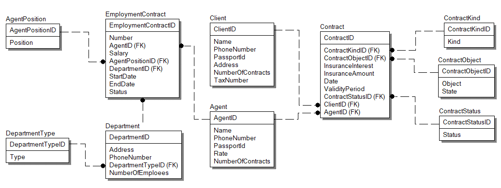

# Course-work

My course work for subject "Fundamentals of automated information systems". 

3rd year, National Research Nuclear University MEPhI

### Brief

This project contains a DB for abstract insurance company. Here is a diagram of the DB:

This cource project also contains a SSIS package for data import. Data is generated randomly in generation script (folder DataGeneration). 

I also made a report with SSRS.

### Technologies used

- MS SQL Server
- MS SSIS
- MS SSRS
- jupyter notebook
